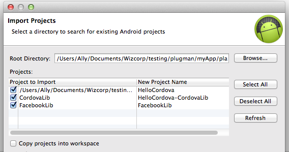
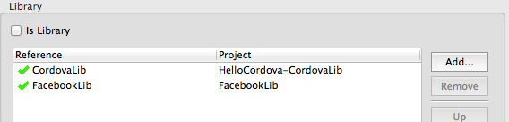

# Facebook Requirements and Set-Up [Android]

To use this plugin you will need to make sure you've registered your Facebook app with Facebook and have an APP_ID (https://developers.facebook.com/apps).

If you plan on rolling this out on Android, please note that you will need to [generate a hash of your Android key(s) and submit those to the Developers page on Facebook](https://developers.facebook.com/docs/android/getting-started/facebook-sdk-for-android/) to get it working. Furthermore, if you are generating this hash on Windows (specifically 64 bit versions), please use version 0.9.8e or 0.9.8d of [OpenSSL for Windows](http://code.google.com/p/openssl-for-windows/downloads/list) and *not* 0.9.8k. Big ups to [fernandomatos](http://github.com/fernandomatos) for pointing this out!

## Example Apps

`platforms/android` and `platforms/ios` contain example projects and all the native code for the plugin for both Android and iOS platforms. They also include versions of the Android and iOS Facebook SDKs. These are used during automatic installation.

For Android sample app remember to configure the project with your FB app id in the `res/values/facebookconnect.xml` file. For example:

	<resources>
    	<string name="fb_app_id">123456789</string>
    	<string name="fb_app_name">TEST</string>
	</resources>

## Install

This plugin requires [Cordova CLI](http://cordova.apache.org/docs/en/3.5.0/guide_cli_index.md.html).

To install the plugin in your app, execute the following (replace variables where necessary)...

	cordova create myApp

	cd myApp/

	cordova platform add android

	cordova -d plugin add /Users/your/path/here/phonegap-facebook-plugin --variable APP_ID="123456789" --variable APP_NAME="myApplication"

## Setup with Eclipse

**Android requires an additional step which is to reference the FacebookSDK project as a library to your project.**

Open your project in Eclipse (New > Project... Existing Android project from source), import everything (***see Img. 1***).

 ***Img. 1***

In Eclipse, right click your project folder in the left-had column. Select "Properties", select Android in the left column and in the right side of the window add FacebookSDK as a library (***see Img. 2***).

 ***Img. 2***

## Setup without Eclipse (just CLI)

Follow the steps below:

	cordova create myApp

	cd myApp/

	cordova platform add android

	cordova -d plugin add https://github.com/phonegap/phonegap-facebook-plugin.git --variable APP_ID="123456789" --variable APP_NAME="myApplication"
	
	android update project --subprojects --path "platforms/android" --target android-19 --library "CordovaLib"
	
	android update project --subprojects --path "platforms/android" --target android-19 --library "FacebookLib"
	
	cd platforms/android/
	
	ant clean
	
	cd FacebookLib
	
	ant clean
	
	open -e AndroidManifest.xml	

	// change your minSdkVersion and your targetSdkVersion to your environment settings for me it was:
	// <uses-sdk android:minSdkVersion="14" android:targetSdkVersion="17" />
	
	ant release
	
	cd ../../..
	
	cordova build android
