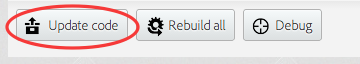

# Facebook Requirements and Set-Up [PhoneGap Build]

To use this plugin you will need to make sure you've registered your Facebook app with Facebook and have an `APP_ID` [https://developers.facebook.com/apps](https://developers.facebook.com/apps).

This guide is for PhoneGap Build only. View the other guides for native setup.

## Install

To install the plugin add the following to your `config.xml`:

```
	<gap:plugin name="com.phonegap.plugins.facebookconnect" version="<VERSION>">
        <param name="APP_ID" value="<YOUR_APP_ID>" />
        <param name="APP_NAME" value="<YOUR_APP_NAME>" />
    </gap:plugin>
    
```

where

- ** \<VERSION\> ** - Version of the plugin. For example `0.8.0`
- ** \<YOUR_APP_ID\> ** - The Facebook application identifier. For example `123456789`
- ** \<YOUR_APP_NAME\> ** - The name of your Facebook application. For example `Super Great App`

Upgade your code on PhoneGap Build website:



You should now see the following:

