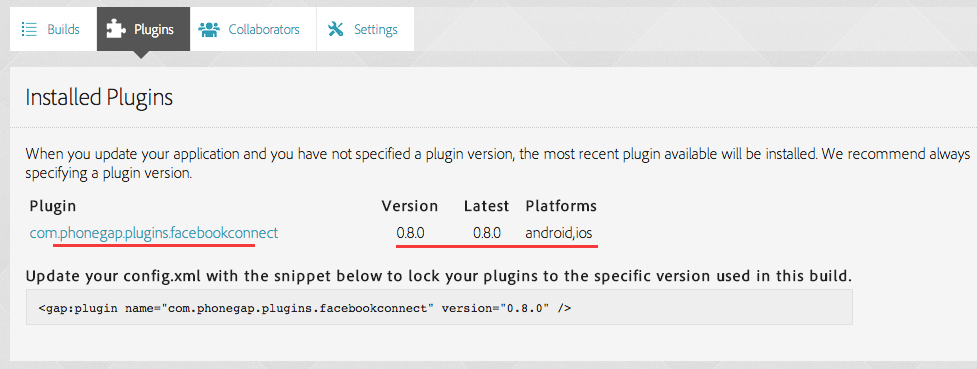

# PhoneGap Build is NO LONGER SUPPORTED

-----

***Due to PhoneGap Build service changes*** [1], we can no longer update the PhoneGap Build plugin inside PhoneGap Build.

PhoneGap Build users must now install into your application via the Cordova Plugin Registry. For example:

```
<gap:plugin name="com.phonegap.plugins.example" source="plugins.cordova.io" />
```

HOWEVER, due to a Plugman (the software that is used to upload to the Cordova Plugin Registry) bug, iOS will not work [2].

Feel free to "+1" this bug to get some attention to the Plugman developers.

***Therefore***, sadly we have decided **stop support for PhoneGap Build** in it's present state. We hope once Plugman is fixed or when PhoneGap Build have a change of policy we'll support it again in the future. This means we will not respond to issues, bugs or feature requests for PhoneGap Build. We will however, **continue to push versions of this plugin to the Cordova Registry.**

Below is the setup (kept for historical reference) for version 0.8.0 which remains available for use.

[1] - [http://community.phonegap.com/nitobi/topics/please-upgrade-your-phonegap-build-account-to-submit-a-plugin](http://community.phonegap.com/nitobi/topics/please-upgrade-your-phonegap-build-account-to-submit-a-plugin)

[2] - [https://issues.apache.org/jira/browse/CB-6092](https://issues.apache.org/jira/browse/CB-60920)

-----

# Facebook Requirements and Set-Up [PhoneGap Build]

To use this plugin you will need to make sure you've registered your Facebook app with Facebook and have an `APP_ID` [https://developers.facebook.com/apps](https://developers.facebook.com/apps).

This guide is for PhoneGap Build only. View the other guides for native setup.

## Install

To install the plugin add the following to your `config.xml`:

```
	<gap:plugin name="com.phonegap.plugins.facebookconnect" version="<VERSION>">
        <param name="APP_ID" value="<YOUR_APP_ID>" />
        <param name="APP_NAME" value="<YOUR_APP_NAME>" />
    </gap:plugin>
    
```

where

- ** \<VERSION\> ** - Version of the plugin. For example `0.8.0`
- ** \<YOUR_APP_ID\> ** - The Facebook application identifier. For example `123456789`
- ** \<YOUR_APP_NAME\> ** - The name of your Facebook application. For example `Super Great App`

Upgade your code on PhoneGap Build website:


You should now see the following:


