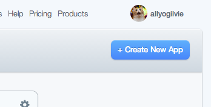
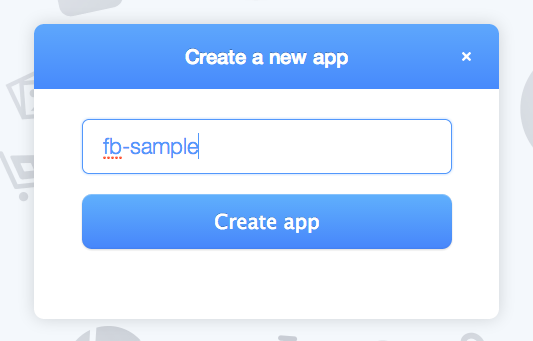
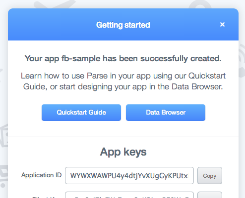
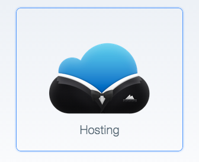
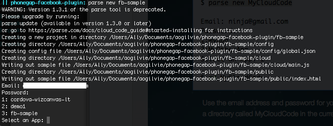
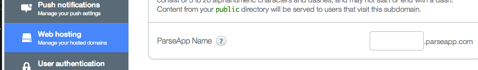

# Create a FB WebApp with Parse

A quick guite to creating a sample FB API app with Parse hosting service.

### Steps

- Sign up / Login to [https://parse.com/](https://parse.com/)
- Create a New App

- Select `Quickstart Guide`

- Select `Hosting`
- Follow the setup instructions for your platform (OS X/Windows)
- Navigate to your desired application folder and run `parse new`.
- Login with your parse account info, then select your application by typing it's number in the list.

- You will see a new `parse` folder. Copy the `phonegap-facebook-plugin` `www` folder content into `parse/public`.
- Run `cd parse` and `parse deploy` to upload your application to parse hosting servers.
- Finally, configure your ParseApp host name. On the Parse website goto Settings > Web Hosting and type the hostname you want.

- Check it out! Navigate to `your-hostname.parseapp.com`

